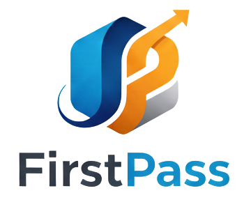

<p align="center">
  
</p>

# 🕵️‍♂️ FirstPass: Real-Time SWE Job Discovery Engine

## 📄 Overview
**FirstPass** is a high-frequency job aggregation and filtering platform specifically engineered for the competitive Software Engineering job market. In a field where the very earliest applicants often get the majority of the attention, FirstPass provides an automated edge. By combining a background scraping engine with a live web dashboard, the system monitors specific job boards and instantly alerts the user via audio cues the second a new role is posted.

Developed with a multi-process architecture, FirstPass separates heavy data acquisition (Python Scraper) from the user interface (Flask/Tailwind), ensuring a non-blocking, sub-second latency experience.

### 🛠️ Tech Stack
<p align="center">
    
    
    
    
    
</p>

---

## 👨🏼‍💻 The SWE Edge: Why I Built This
As a future Software Engineer, the job search is often a race against algorithms. I built FirstPass to solve three specific pain points:
- **Application Latency:** Being among the first to apply to a new posting on LinkedIn or Indeed drastically increases the callback rate.
- **Context Switching:** Instead of manually refreshing tabs while coding, I offloaded the monitoring task to this engine.
- **Data Centralization:** Consolidating niche job boards into a single, clean UI tailored to my specific tech stack.

---

## 🚀 Key Features

### 📡 Live Sync Dashboard
- **Dynamic Polling:** The UI checks the backend every **60 seconds** for database updates.
- **Smart Refresh:** To save resources, the DOM only re-renders when a change in job count is detected, preventing unnecessary CPU spikes.
- **Visual Status:** A pulsing **Live Feed** indicator and timestamp keep the user informed of the last successful database sync.

### 🔊 Audio Alert System
- **Randomized Playlists:** Uses **pygame** to play randomized high-energy notification sounds the moment a job is saved to the DB.
- **Snooze Logic:** A global **Snooze** state allows the user to silence the audio engine directly from the web UI without killing the scraper process.

### 🌙 Adaptive UX & Night Mode
- **Snooze-Integrated UI:** Toggling **Snooze** switches the entire dashboard into a high-contrast dark mode to reduce eye strain during late-night deep work sessions.
- **Smooth Transitions:** Full CSS transition support for a premium, desktop-app feel.

### 📧 One-Click Application
- **Mobile Handover:** Instantly triggers a backend mailer to send job links to my personal device, allowing me to review the full job description at any moment.
- **Queue Management:** Status-based filtering (New, Saved, Deleted) ensures a zero-inbox philosophy for job hunting.

---

## 🗂️ Project Architecture

FirstPass operates as two independent processes communicating through a shared SQLite database and a file-based state management system for the snooze functionality.


### 📊 System Design
- **`app.py`**: The **Flask Web Server** managing API endpoints and serving the responsive dashboard.
- **`simplify.py`**: The **Scraper Engine** — a persistent loop that executes job board requests and manages the audio notification logic.
- **`jobs.db`**: Centralized **SQLite Storage** utilizing an IntegrityError check to prevent duplicate entries of the same Job ID.

---

## 🛠️ Local Setup Instructions

### ✅ Prerequisites
To run FirstPass locally, please ensure you have the following installed:
- [Python 3.10+](https://www.python.org/)
- [Git](https://git-scm.com/)

### 1. Clone the Repository
```bash
git clone [https://github.com/your-username/firstpass.git](https://github.com/your-username/firstpass.git)
cd firstpass
```

### 2. Install the Dependencies
```bash
pip install -r requirements.txt
```

## 3. 
